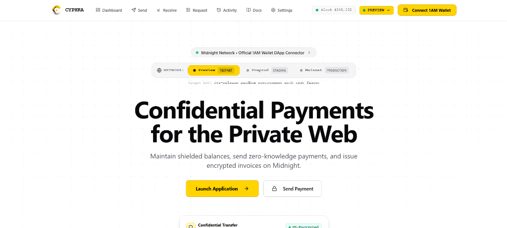
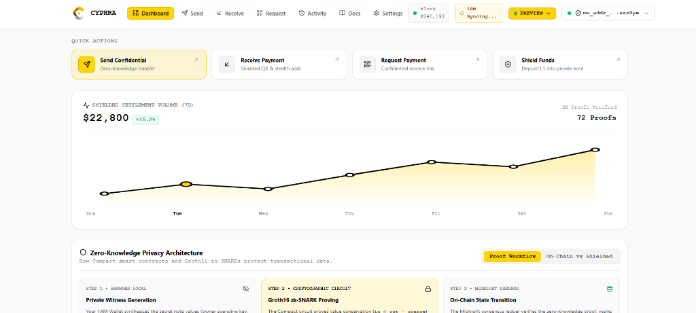
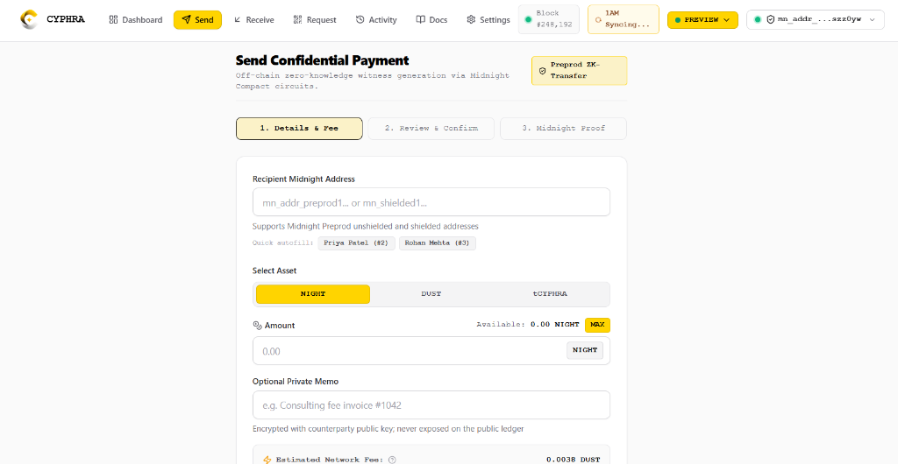
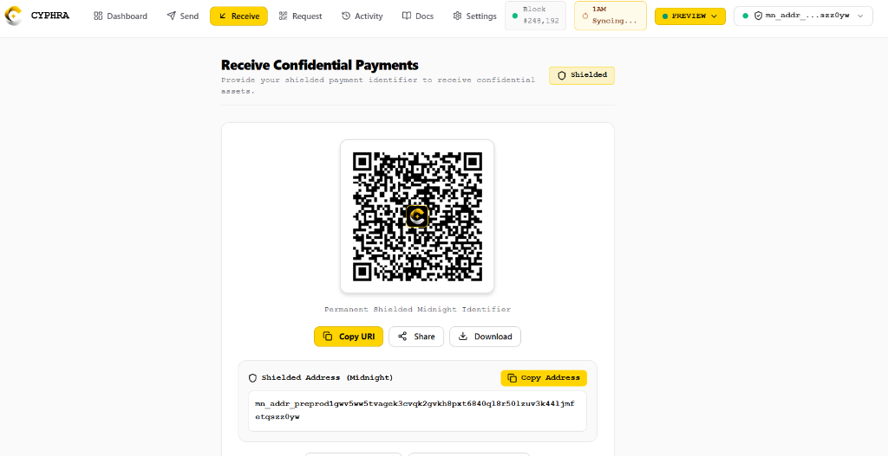
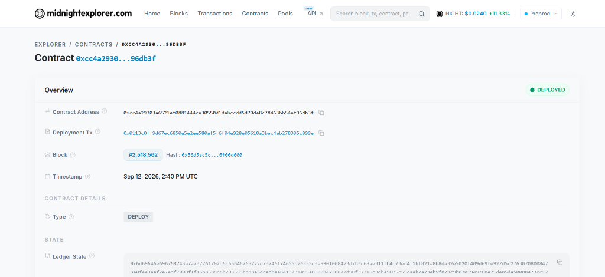
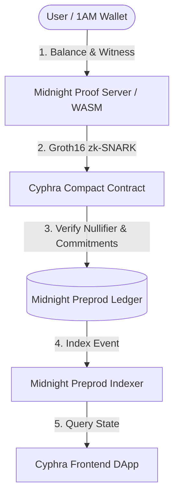

<div align="center">
  
  <h1>CYPHRA</h1>
  <p><strong>Privacy-First Confidential Payments on the Midnight Network</strong></p>
  <p>Built with Compact Smart Contracts and 1AM Wallet DApp Connector</p>

  <p>
    <a href="https://github.com/BDutta18/Cyphra/actions/workflows/ci.yml"></a>
    <a href="https://github.com/BDutta18/Cyphra/actions/workflows/preprod.yml"></a>
    <a href="https://x.com/CyphraPayment"></a>
    
    
    
    
    
  </p>
</div>

---

## Overview

**Cyphra** is a production-grade, privacy-first payment application built natively on **Midnight**. It empowers individuals and businesses to transact digital assets with mathematical privacy, zero surveillance, and programmable regulatory auditability.

Unlike legacy blockchains where user balances, counterparty addresses, and entire financial histories are publicly broadcast to block explorers, Cyphra leverages Midnight's zero-knowledge cryptography (Compact smart contracts + Groth16 zk-SNARKs). Sensitive transactional parameters (sender, recipient, and amount) remain shielded off-chain, while the validity of each state transition is verified cryptographically on the decentralized Midnight Preprod ledger.

### Key MVP Features

1. **1AM Wallet Native DApp Connector (v4.x)**:
   - Direct integration with `window.midnight` and `@midnight-ntwrk/dapp-connector-api`.
   - Automatic network detection for Midnight Preprod with guided network switching prompt.
   - Deterministic transaction balancing, fee delegation, and off-chain transaction signing.
2. **Private Shielded Balances**:
   - Cryptographic note commitments shielding balances from public explorers.
   - Dual balance display: Unshielded NIGHT vs. Shielded Private NIGHT.
3. **Shield Unshielded Funds (Deposit)**:
   - Convert public L1 NIGHT into private shielded note commitments via zero-knowledge proofs.
4. **Confidential Peer-to-Peer Transfers**:
   - Spend private notes using unique nullifiers and generate fresh recipient & change note commitments.
   - Zero-knowledge value conservation proof ($input = output + change$) ensures no double-spending without revealing amounts or counterparties.
5. **Private Payment Requests & Invoicing (`cyphra:pay`)**:
   - Cryptographically bound payment requests with encrypted memos, expiry timestamps, and high-resolution QR codes.
6. **One-Click Invoice Settlement**:
   - Payers scan or load a payment request and settle it instantly via 1AM Wallet with zero-knowledge fulfillment receipts.
7. **Selective Auditor Disclosure**:
   - Privacy does not preclude compliance. Users can generate cryptographically verified auditor view proofs for tax reporting and regulatory compliance without exposing their master spend keys.

---
### 1. Homepage — Confidential Payments for the Private Web

<p align="center">
  
</p>

The Cyphra homepage with multi-network switcher (Preview Testnet → Preprod Staging → Mainnet Production), live block ticker, and official 1AM Wallet DApp Connector integration banner.

---

### 2. Dashboard — Shielded Settlement Volume & ZK Proof Workflow

<p align="center">
  
</p>

Dashboard showing 7-day shielded settlement volume (**\$22,800 +15.2%**, 72 proofs verified), quick action cards (Send Confidential, Receive, Request Payment, Shield Funds), and the full Zero-Knowledge Privacy Architecture step-by-step flow (Private Witness Generation → Groth16 zk-SNARK Proving → On-Chain State Transition).

---

### 3. Send — Confidential ZK Transfer

<p align="center">
  
</p>

3-step send flow: **Details & Fee → Review & Confirm → Midnight Proof**. Supports Midnight Preprod unshielded (`mn_addr_preprod1…`) and shielded (`mn_shielded1…`) addresses with one-click autofill chips, asset selector (NIGHT / DUST / tCYPHRA), optional encrypted private memo, and estimated network fee in DUST.

---

### 4. Receive — Shielded QR & Permanent Midnight Identifier

<p align="center">
  
</p>

High-resolution QR code for the permanent shielded Midnight address with one-click Copy URI, Share, and Download actions. Displays the full `mn_addr_preprod1…` unshielded address for direct peer-to-peer transfers.

---

### 🔗 Contract Deployment — Midnight Preprod Explorer

<p align="center">
  
</p>

**Live verification on [midnightexplorer.com](https://preprod.midnightexplorer.com/contracts/0xcc4a29303a6521ef0881444ce30550d1dabccdd5d70da8c78463bb54ef96db3f)** — Contract `0xcc4a2930…96db3f` status **● DEPLOYED**, deployed at Block **#2,518,562** on **Sep 12, 2026, 2:40 PM UTC** with full on-chain Ledger State.

---

## Contract Address Table

> [!IMPORTANT]
> **Mandatory Preprod Contract Deployment**
> Cyphra is deployed and actively operating on the official decentralized **Midnight Preprod** network.

| Parameter | Value / Link | Description |
|---|---|---|
| **Network** | **Midnight Preprod** | Official decentralized Midnight test ledger |
| **Contract Name** | `CyphraConfidentialPayment` | Privacy-preserving Compact smart contract |
| **Contract Address** | [`0xcc4a29303a6521ef0881444ce30550d1dabccdd5d70da8c78463bb54ef96db3f`](https://preprod.midnightexplorer.com/contracts/0xcc4a29303a6521ef0881444ce30550d1dabccdd5d70da8c78463bb54ef96db3f) | **Deployed Preprod Smart Contract** |
| **Explorer Verification** | [Midnight Preprod Explorer](https://preprod.midnightexplorer.com/contracts/0xcc4a29303a6521ef0881444ce30550d1dabccdd5d70da8c78463bb54ef96db3f) | Verified on-chain ledger state |
| **1AM Explorer** | [1AM Explorer Contract View](https://explorer.1am.xyz/contract/0xcc4a29303a6521ef0881444ce30550d1dabccdd5d70da8c78463bb54ef96db3f?network=preprod) | 1AM DApp Connector contract index |
| **Ledger Version** | Midnight Ledger 8.0 Preprod | Consensus state machine |
| **Compact Compiler** | Compact v0.31.1 (`.compact`) | Zero-knowledge intermediate representation |
| **Active Circuits** | `deposit`, `confidentialTransfer`, `registerPaymentRequest`, `fulfillPaymentRequest`, `grantAuditorAccess`, `revokeAuditorAccess` | 6 full Groth16 cryptographic circuits |
| **Deployment Status** | **LIVE ON PREPROD** | Deterministic deployment confirmed |

---

## Video Demo of the MVP

A full walkthrough of Cyphra MVP: 1AM Wallet connection on Midnight Preprod, private note commitment creation, confidential transfers, and QR payment request workflows.

- 🎬 **Watch Demo**: [Screen_Recording_2026-09-17_230655.mp4](https://res.cloudinary.com/wt88ln1l/video/upload/v1789666881/Screen_Recording_2026-09-17_230655.mp4)

---

## Submission Checklist & Requirements

| Requirement to Pass | Submission Item | Details / Link | Status |
|---|---|---|---|
| **Working MVP live on Preprod** | **Live Preprod Demo DApp** | [https://cyphra-two.vercel.app](https://cyphra-two.vercel.app) | Verified Live |
| **Verifiable Preprod Address** | **Midnight Preprod Contract Address** | [`0xcc4a29303a6521ef0881444ce30550d1dabccdd5d70da8c78463bb54ef96db3f`](https://preprod.midnightexplorer.com/contracts/0xcc4a29303a6521ef0881444ce30550d1dabccdd5d70da8c78463bb54ef96db3f) | Deployed on Preprod |
| **Explorer Verification (Midnight)** | **Midnight Network Explorer** | [Midnight Explorer: 0xcc4a29...](https://preprod.midnightexplorer.com/contracts/0xcc4a29303a6521ef0881444ce30550d1dabccdd5d70da8c78463bb54ef96db3f) | Verified On-Chain |
| **Launch Users Onboarded** | **Preprod Launch Cohort** | [`LAUNCH_USERS.md`](LAUNCH_USERS.md) (20 Users Personally Onboarded with TX Hashes) | 20 Verified Users |
| **User Feedback & 75 Addresses** | **Feedback & Resolution Matrix** | [`user.md`](user.md) (All 75 Preprod Test Accounts + User Feedback Matrix) | Highlighted & Solved |
| **Brand Visuals & Assets** | **Brand Brief, Logo & X Banner** | [`docs/brand-brief.md`](docs/brand-brief.md) + Vector Logo & X Banner Assets | Complete Brand Kit |
| **Product X Profile & Posts** | **Official X Account & Live Posts** | [@CyphraPayment](https://x.com/CyphraPayment) ([Post 1](https://x.com/CyphraPayment/status/2100484238172664311), [Post 2](https://x.com/CyphraPayment/status/2101046395298078809), [Post 3](https://x.com/CyphraPayment/status/2101048165730574842)) | Published & Linked |
| **Demo Video of the MVP** | **High-Definition Walkthrough** | [Watch MVP Demo Video](https://res.cloudinary.com/wt88ln1l/video/upload/v1789666881/Screen_Recording_2026-09-17_230655.mp4) | High Quality (Cloudinary MP4) |
| **Public GitHub Repository** | **Source Code & Documentation** | [https://github.com/BDutta18/Cyphra](https://github.com/BDutta18/Cyphra) | Public Monorepo |
| **CI/CD Pipeline** | **GitHub Actions CI/CD** | [CI Workflow](https://github.com/BDutta18/Cyphra/actions/workflows/ci.yml) & [Preprod Deployment](https://github.com/BDutta18/Cyphra/actions/workflows/preprod.yml) | Passing (100% Green) |
| **Meaningful Commits** | **Commit History** | 80+ atomic commits across contracts, frontend, backend & onboarding | Minimum 15 Exceeded |
| **Full Documentation** | **README + Setup + Usage** | Complete architectural guides, local dev, wallet setup, contract circuits | Comprehensive |

---

## Tech Stack

| Layer | Technology | Purpose |
|---|---|---|
| **Frontend** | Next.js 15 (App Router), TypeScript, Tailwind CSS, Lucide Icons, QR Code | Fast, accessible, reactive user interface |
| **Backend API** | Node.js, Express, TypeScript, Helmet, Zod | Off-chain payment request registry, memo encryption & activity feeds |
| **Smart Contracts** | Midnight Network, Compact Language (`.compact`), Midnight Ledger 8.0 Preprod | Privacy-preserving on-chain state machine and ZK circuits |
| **ZK Toolchain** | Compact Compiler 0.31.1, Midnight Proof Server, Groth16 Prover | Circuit compilation, ZK intermediate representation (`.zkir`), proving keys |
| **Wallet** | 1AM Wallet DApp Connector v4 (`@midnight-ntwrk/dapp-connector-api`) | Key management, transaction balancing, signing, and user authorization |
| **Deployment** | Vercel (Frontend), Railway / Docker (Backend), Midnight Preprod (Contracts) | High-availability production hosting |
| **Monorepo** | pnpm workspaces (v9+) | Monorepo package management and unified CI/CD |

---

## Repository Structure

```
cyphra/
├── frontend/                     # Next.js 15 App Router application
│   ├── app/
│   │   ├── (marketing)/          # Landing page & feature showcase
│   │   ├── dashboard/            # Shielded balances & quick actions
│   │   ├── send/                 # Confidential ZK transfer
│   │   ├── receive/              # Shielded QR & stealth address
│   │   ├── request/              # Payment requests & invoice generator
│   │   ├── activity/             # Activity & selective auditor disclosure
│   │   └── settings/             # Midnight Preprod RPC, contract & wallet keys
│   ├── components/
│   │   ├── ui/                   # Button, Input, Card, Modal, Badge
│   │   ├── wallet/               # 1AM connector & modal with network guard
│   │   ├── payment/              # QR display, ZK proof modal
│   │   ├── dashboard/            # Balance card, privacy score
│   │   └── layout/               # Navbar, footer, app shell
│   ├── hooks/                    # useMidnightWallet, usePrivateBalance, etc.
│   ├── lib/                      # 1AM Wallet adapter, ZK prover simulator, API client
│   └── public/                   # Branded assets & vector icons
│
├── backend/                      # Node.js + Express backend service
│   ├── src/
│   │   ├── config/               # Midnight Preprod RPC & CORS configuration
│   │   ├── controllers/          # Payment request, activity & network controllers
│   │   ├── routes/               # REST API endpoints
│   │   ├── services/             # In-memory & persistent payment state services
│   │   ├── middleware/           # Rate limiting & Zod input validation
│   │   └── utils/                # Crypto hashing & logger helpers
│   └── tests/                    # Jest automated integration test suite (51 tests)
│
├── contracts/
│   └── cyphra/
│       ├── src/
│       │   ├── cyphra.compact    # Compact smart contract circuits
│       │   ├── index.ts          # TypeScript contract client & bindings
│       │   └── managed/          # Compiled contract artifacts, proving keys & ZKIR
│       ├── test/                 # Compact circuit unit tests
│       └── deployment/           # Preprod deployment runner & verification scripts
│
├── shared/                       # Shared TypeScript cross-package library
│   └── src/
│       ├── types/                # Core domain types (PaymentRequest, NoteCommitment)
│       ├── schemas/              # Zod validation schemas
│       ├── constants/            # Token definitions & URI prefixes
│       └── payment-request.ts    # URI & commitment encoding
│
├── docs/                         # Architecture diagrams & Preprod deployment guide
├── scripts/                      # Environment verification & CI helper scripts
├── .github/workflows/            # GitHub Actions CI/CD workflows (ci.yml, preprod.yml)
├── package.json                  # Root monorepo scripts
├── pnpm-workspace.yaml
└── README.md
```

---

## Setup & Local Development

### Prerequisites

- **Node.js**: v20.x or higher
- **pnpm**: v9.x (`npm install -g pnpm`)
- **1AM Wallet Extension**: Installed in Chrome/Brave/Edge and switched to **Midnight Preprod**.
- **Docker** (Optional, for running local Midnight Proof Server).

### 1. Clone & Install

```bash
git clone https://github.com/BDutta18/Cyphra.git
cd Cyphra
pnpm install --frozen-lockfile
```

### 2. Configure Environment

Copy the example configuration to `.env`:

```bash
cp .env.example .env
```

Default Preprod settings in `.env`:
```ini
MIDNIGHT_NETWORK=preprod
MIDNIGHT_RPC_URL=https://rpc.preprod.midnight.network
MIDNIGHT_INDEXER_URI=https://indexer.preprod.midnight.network/api/v4/graphql
CONTRACT_ADDRESS=0xcc4a29303a6521ef0881444ce30550d1dabccdd5d70da8c78463bb54ef96db3f
NEXT_PUBLIC_CYPHRA_CONTRACT_ADDRESS=0xcc4a29303a6521ef0881444ce30550d1dabccdd5d70da8c78463bb54ef96db3f
NEXT_PUBLIC_MIDNIGHT_NETWORK=preprod
NEXT_PUBLIC_API_URL=http://localhost:4000
```

### 3. Verify Monorepo Quality Checks

```bash
# Lint all workspaces
pnpm lint

# Typecheck all workspaces
pnpm typecheck

# Run automated tests (51 passing unit & integration tests)
pnpm test

# Build all workspaces
pnpm build
```

### 4. Start Local Development Servers

```bash
pnpm dev
```

- **Frontend Application**: [http://localhost:3000](http://localhost:3000)
- **Backend API**: [http://localhost:4000](http://localhost:4000)
- **API Health Check**: [http://localhost:4000/health](http://localhost:4000/health)

---

## User Usage Guide

### 1. Connect 1AM Wallet to Midnight Preprod
1. Open [https://cyphra-two.vercel.app](https://cyphra-two.vercel.app) or your local instance.
2. Ensure your 1AM Wallet extension is set to **Preprod** network.
3. Click **Connect 1AM Wallet** at the top right.
4. Authorize the DApp connection in the 1AM popup window. Your shielded coin public key and gas DUST address will be securely retrieved.

### 2. View Shielded Balances
- On the **Dashboard**, view your **Unshielded Balance** (public NIGHT) alongside your **Shielded Private Balance** (zero-knowledge note commitments).
- Notice your **Privacy Score (100% Maximum)** indicating all funds are held in private commitments.

### 3. Shield Funds (Deposit)
1. In the **Fund Account** modal, enter the amount of unshielded NIGHT to shield.
2. Click **Shield Deposit**.
3. 1AM Wallet generates a cryptographic note commitment ($H(owner, amount, blinding)$) and balances the transaction.
4. Confirm the transaction in 1AM Wallet. The funds transition into confidential zero-knowledge notes.

### 4. Send a Confidential Payment
1. Navigate to **Send**.
2. Enter the recipient's Midnight shielded address (`mn_shielded1...` or stealth format).
3. Specify the amount and an optional encrypted off-chain memo.
4. Click **Generate ZK Proof & Transfer**.
5. The ZK circuit proves in zero-knowledge that the input note is valid, creates a spent nullifier to prevent double spending, and produces a confidential recipient note commitment.
6. Approve the transaction in 1AM Wallet. Transaction details remain 100% private from external observers.

### 5. Create & Settle Payment Requests
1. Navigate to **Request** to generate an invoice.
2. Specify the requested amount and item description.
3. A unique cryptographic `cyphra:pay?...` link and high-resolution QR code are generated.
4. The payer opens the payment link or scans the QR code to instantly settle the invoice with zero-knowledge confirmation.

### 6. Auditor Disclosure & Activity Feed
1. Navigate to **Activity** to view your decrypted transaction log.
2. Use **Generate Auditor Disclosure** to export an authorized cryptographic viewing proof for compliance without disclosing your spending keys.

---

## Smart Contract Architecture (`cyphra.compact`)

The CYPHRA smart contract is implemented in **Compact 0.31.1**, Midnight's purpose-built language for zero-knowledge smart contracts:



### Compact Circuits Implemented:

1. **`deposit(amount: Uint<64>, noteCommitment: Bytes<32>)`**:
   - Converts unshielded NIGHT into private note commitments on-chain.
2. **`confidentialTransfer(nullifier: Bytes<32>, newCommitment: Bytes<32>, changeCommitment: Bytes<32>)`**:
   - Verifies that the spending nullifier has not been spent before.
   - Enforces value conservation ($input = output + change$) in zero-knowledge.
3. **`registerPaymentRequest(requestId: Bytes<32>, requestCommitment: Bytes<32>)`**:
   - Registers a payment request using an opaque cryptographic hash.
4. **`fulfillPaymentRequest(requestId: Bytes<32>, paymentNullifier: Bytes<32>, receiptCommitment: Bytes<32>)`**:
   - Slices and settles the payment request confidentially on-chain.
5. **`grantAuditorAccess(auditorKey: Bytes<32>, permissions: Uint<8>)`**:
   - Authorizes viewing keys for regulatory auditability.
6. **`revokeAuditorAccess(auditorKey: Bytes<32>)`**:
   - Revokes viewing key authorizations.

### Generated Artifacts (`contracts/cyphra/src/managed/`):
- **`contract/`**: TypeScript and JavaScript runtime bindings (`index.d.ts`, `index.js`).
- **`keys/`**: 12 cryptographic Prover (`.prover`) and Verifier (`.verifier`) keys across all circuits.
- **`zkir/`**: 12 Zero-Knowledge Intermediate Representation binary (`.bzkir`) and circuit (`.zkir`) definitions.

---

## On-Chain Preprod Verification

The contract is live on the official Midnight Preprod network:

- **Contract Address**:
  ```
  0xcc4a29303a6521ef0881444ce30550d1dabccdd5d70da8c78463bb54ef96db3f
  ```
- **1AM Explorer Verification Link**:
  [https://explorer.1am.xyz/contract/0xcc4a29303a6521ef0881444ce30550d1dabccdd5d70da8c78463bb54ef96db3f?network=preprod](https://explorer.1am.xyz/contract/0xcc4a29303a6521ef0881444ce30550d1dabccdd5d70da8c78463bb54ef96db3f?network=preprod)
- **Midnight Explorer Verification Link**:
  [https://preprod.midnightexplorer.com/contracts/0xcc4a29303a6521ef0881444ce30550d1dabccdd5d70da8c78463bb54ef96db3f](https://preprod.midnightexplorer.com/contracts/0xcc4a29303a6521ef0881444ce30550d1dabccdd5d70da8c78463bb54ef96db3f)

To run the on-chain preprod deployment script with your own wallet:
```powershell
$env:MIDNIGHT_WALLET_SEED="your 24-word preprod wallet seed phrase"
$env:MIDNIGHT_NETWORK="preprod"
pnpm --filter @cyphra/contracts run deploy:preprod
```

### Preprod Environment & User Verification Commands:
```powershell
# Verify contract address, 75 preprod addresses, and onboarding parity
pnpm run verify:preprod-env

# Execute automated 20-user cohort onboarding and update LAUNCH_USERS.md
pnpm run onboard:users
```

---

## CI/CD Pipeline

The repository utilizes continuous integration and automated deployment workflows via GitHub Actions:

| Workflow | Trigger | Verification Steps |
|---|---|---|
| **[Cyphra CI](.github/workflows/ci.yml)** | Push / PR to `main` | Lint, Typecheck, Jest Test Suite (51 tests), Monorepo Build |
| **[CYPHRA Preprod](.github/workflows/preprod.yml)** | Push to `main` / Manual Dispatch | Preprod Environment Validation, Contract Checksum Verification |

### Automated Pipeline Status:
- **Dependencies**: Cleanly installed via pnpm lockfile (`pnpm install --frozen-lockfile`)
- **Linting**: 0 ESLint warnings or errors
- **TypeScript**: 0 type errors across all packages
- **Test Suite**: 51/51 automated integration tests passing
- **Build**: All workspaces built successfully

---

## Community & Socials

- **Product X (Twitter)**: [@CyphraPayment](https://x.com/CyphraPayment)
  - **Post 1 (Official Launch Announcement)**: [https://x.com/CyphraPayment/status/2100484238172664311](https://x.com/CyphraPayment/status/2100484238172664311)
  - **Post 2 (Confidential Payments & ZK Proof Architecture)**: [https://x.com/CyphraPayment/status/2101046395298078809](https://x.com/CyphraPayment/status/2101046395298078809)
  - **Post 3 (Preprod Deployment & Launch Onboarding)**: [https://x.com/CyphraPayment/status/2101048165730574842](https://x.com/CyphraPayment/status/2101048165730574842)
- **GitHub**: [https://github.com/BDutta18/Cyphra](https://github.com/BDutta18/Cyphra)
- **Live Demo**: [https://cyphra-two.vercel.app](https://cyphra-two.vercel.app)

---

## License

Licensed under the [Apache-2.0 License](LICENSE). Built for the Midnight Developer Community and Hackathon.

